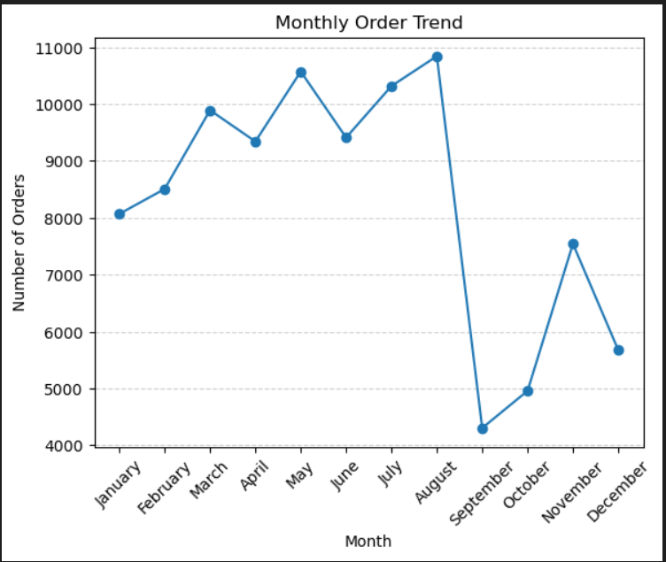

# 📊 Exploratory Data Analysis – Brazilian E-Commerce Dataset

## 📌 Project Overview
This project performs Exploratory Data Analysis (EDA) on the Brazilian E-Commerce Public Dataset by Olist to extract meaningful business insights.

## 📁 Dataset
Brazilian E-Commerce Public Dataset by Olist (2016–2018).

## 🛠 Tools Used
- Python
- Pandas
- NumPy
- Matplotlib
- Seaborn

## 🔎 Analysis Performed
- Data cleaning & preprocessing
- Revenue calculation
- Monthly order trend analysis
- Top product categories by revenue
- Payment method distribution
- Order status breakdown

## 📈 Key Insights
- Strong growth observed from 2016 to 2018.
- Revenue concentrated in top-performing categories.
- Majority of transactions via credit card.
- High delivery success rate (~97%).

## Sample Screenshot

