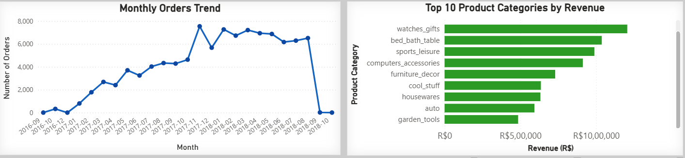
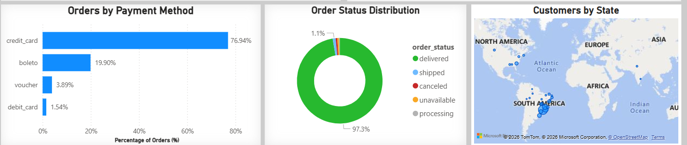

# 📊 Brazil E-Commerce Performance Dashboard

## 📌 Project Overview
This project presents a Power BI dashboard analyzing Brazilian e-commerce data from 2016–2018. The dashboard provides insights into revenue performance, customer behavior, product trends, and operational efficiency.

---

## 🎯 KPIs Included
- Total Revenue
- Average Order Value (AOV)
- Total Orders
- Average Delivery Time

---

## 📈 Visualizations
- Monthly Orders Trend
- Top 10 Product Categories by Revenue
- Payment Methods Distribution
- Order Status Distribution
- Customers by State (Map View)

---

## 🛠 Tools Used
- Power BI
- DAX
- Data Modeling

---

## 📊 Key Insights
- Strong revenue growth trend across years.
- Credit card dominates payment methods.
- High delivery success rate (~97% delivered orders).
- Revenue concentrated in top-performing product categories.

---

## 📸 Dashboard Preview

### Full Dashboard

### KPI Section

### Monthly Trend

### Orders

---

## 🚀 Outcome
This dashboard demonstrates skills in data modeling, KPI design, interactive reporting, and business insight generation using Power BI.
