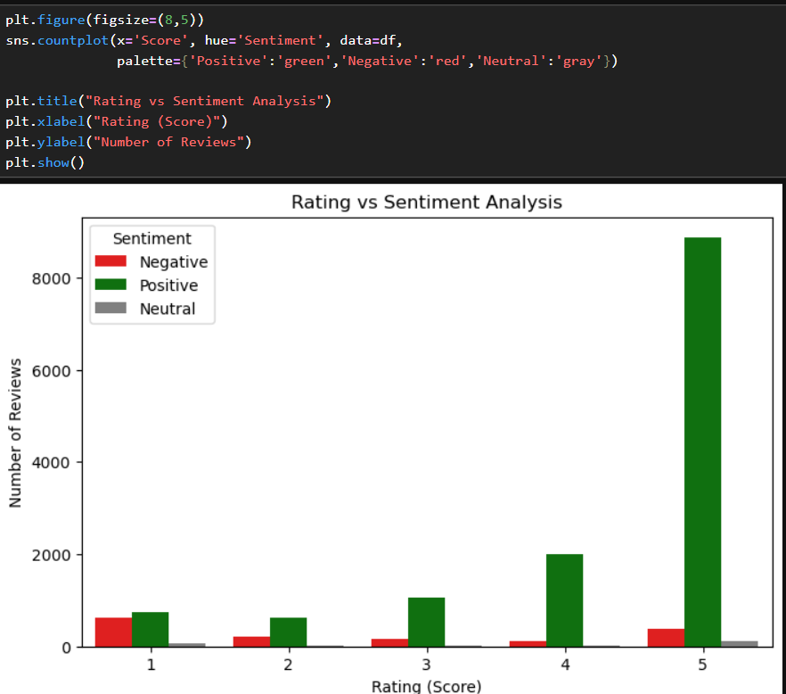

# 🧠 CodeAlpha Task 4: Sentiment Analysis

This project performs sentiment analysis on Amazon Fine Food Reviews using TextBlob.

## 📌 Features

- Data Cleaning
- Sentiment Classification (Positive / Negative / Neutral)
- Sentiment Distribution Visualization
- Rating vs Sentiment Analysis
- Word Cloud for Positive Reviews
- Word Cloud for Negative Reviews
- Business Insights & Conclusion

## 📊 Sample Visualizations

---
Note: Dataset is not uploaded due to large file size. 
Dataset used: Amazon Fine Food Reviews (Kaggle).

This project demonstrates application of NLP techniques for extracting insights from customer feedback data.
